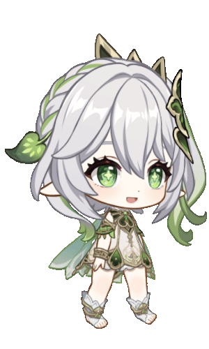
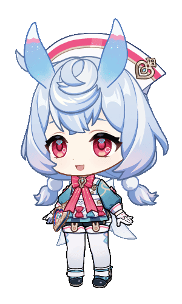

# GI-Character-Spine

A collection of Spine models of Genshin Impact characters from web events and in-game.

Note: The official Spine runtime cannot play animations stored in the `extra` section of JSON files, as they are proprietary to miHoYo.